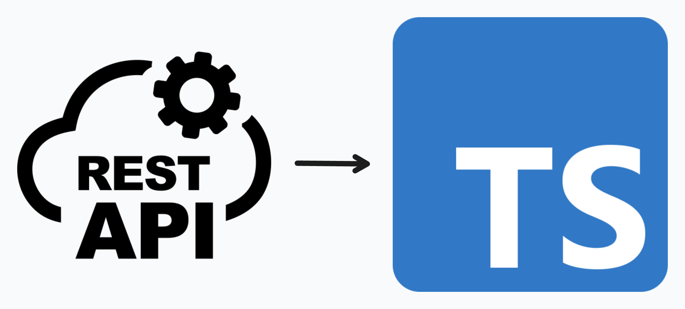
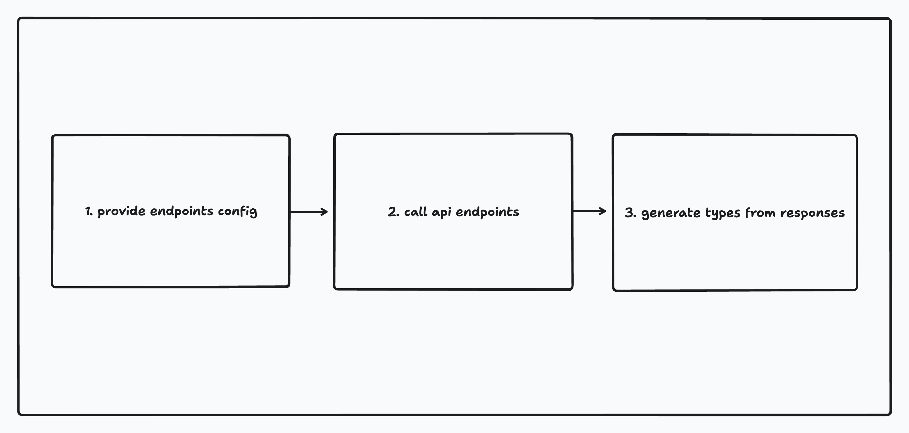

# REST to TS

A proof of concept of generating TypeScript types from REST API endpoints.

<div style="text-align: center;">
  
</div>

## Why?

Sometimes you have a REST API that doesn't have OpenAPI spec or it is difficult to get one, but you still want to generate types for it. This is a quick way to do it.

## How it works?



1. A configuration is provided with the endpoints you want to generate types for.
2. API calls are made to each endpoint with the provided variations.
3. The responses are extracted and used to generate the types with the help of [quicktype](https://github.com/glideapps/quicktype).

## Usage:

```bash
# Install dependencies
npm install

# Start the API
npm run start-api

# Generate the types
npm run generate-types
```

## Configuration

Configuration is defined in the `src/config.ts` file.

## License

This project is licensed under the MIT License. See the [LICENSE](LICENSE) file for details.
